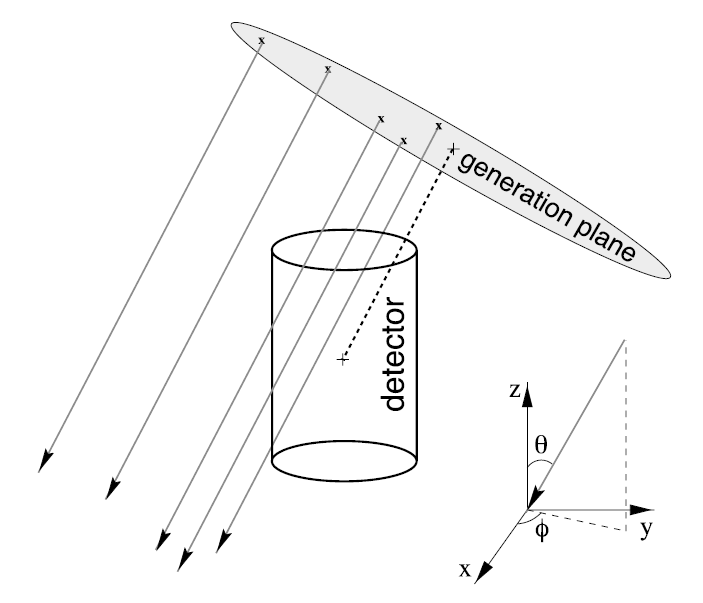
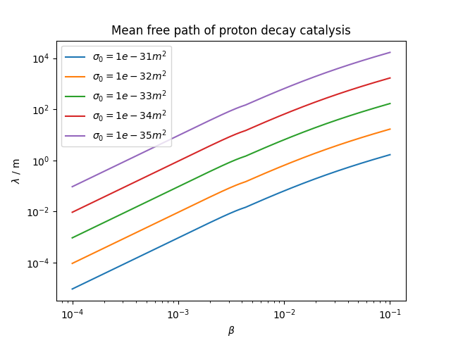

# ExoticGenerator

The exotic-generator project is an upgrade of the old monopole-generator project, providing two modules to simulate not only magnetic monopoles, but also Qballs and Shadow-charges in IceCube: The `I3ExoticGenerator` generates randomly distributed exotic particles. The `I3ExoticPropagator` then propagates those particles. The propagator currently includes proton decay catalysis for slow magnetic monopoles, as well as simple, track-like propagation. The project is still evolving as it aims to include all possible interaction mechanisms of all exotic particles that are sought for in IceCube. It was thus written in a generic way to simplify the implementation of additional processes or particles.

## Usage

```python
tray.AddService("I3GSLRandomServiceFactory", "random")
tray.AddModule("I3InfiniteSource", "infinite", Stream = icetray.I3Frame.DAQ)
tray.AddModule("I3ExoticGenerator", "generator")(
  ("TreeName", "I3MCTree"),
  ("InfoName", "EXOInfoDict"),
  ("NEvents", 0),
  ("PartID", -41),
  ("Mass", NAN),
  ("Charge", 1)
  ("BetaRange", [NAN, NAN]),
  ("PowerLawIndex", 0.),
  ("Disk_dist", 1000 * icetray.I3Units.m),
  ("Disk_rad", 800 * icetray.I3Units.m),
  ("Length", 2 * Disk_dist),
  ("ZenithRange", [0.0 * I3Units::degree, 180.0 * I3Units::degree]),
  ("AzimuthRange", [0.0 * I3Units::degree, 360.0 * I3Units::degree]),
  ("Rad_on_disk", NAN),
  ("Azi_on_disk", NAN),
  ("StartTime", 0.),
  ("ShiftCenter", [0., 0., 0.])
)
tray.AddModule("I3ExoticPropagator", "propagator")(
  ("InputTreeName", "I3MCTree"),
  ("OutputTreeName", "I3MCTree"),
  ("InfoName", "EXOInfoDict"),
  ("MeanFreePath", -1),
  ("CrossSection", NAN),
  ("ScaleEnergy", False),
  ("EnergyScaleFactor", 1.0),
  ("UseCorrectDecay", False),
  ("KeepPrimary", True),
  ("MaxDistanceFromCenter", 1300*icetray.I3Units.m),
  ("CalculateEnergy", False),
  ("StepSize", NAN),
  ("MinLength", NAN),
  ("MaxLength", NAN),
  ("Profiling", False),
  ("ParticleCheck", True)
)
```

For a working example, see [resources/examples/PlotGeneratingDistributions.py](resources/examples/PlotGeneratingDistributions.py).
For a detailed flexible python script with the whole simulation chain, see [resources/ReadyToUse_script/FullSimulation.py](resources/ReadyToUse_script/FullSimulation.py).

### Exotic-Generator Parameters

- **`TreeName`** (Default: "I3MCTree")
  Name of the `I3MCTree` to write the generated exotic particle to.
- **`InfoName`** (Default: "EXOInfoDict")
  Name of the exotic particle info dictionary. The generator writes generation parameters into this dictionary.
- **`Nevents`** (Default: 0)
  Number of events to be generated for the simulation. The number of generated particles (=nbr of Qframes) will be Nevents-3.
- **`PartID`** (Default: `-41`)
  Particle identifier: -41 for a magnetic monopole, -42 for a shadow charge and -43 for a Qball.
- **`Mass`** (Default: `NaN`)
  Mass of the exotic particle. Only really needed if you calculate energy losses along the trajectory. Example: `1e7 * I3Units::GeV`.
- **`Charge`** (Default: `1`)
  Charge of the exotic particle. If monopole (-41), this parameter is the n in the formula g=n*gD, where gD is the Dirac charge and g the magnetic charge.
- **`BetaRange`** (Default: `[NaN, NaN]`)
  Velocity range of the exotic particle as array of lower and upper boundary. If a fixed velocity is desired, set lower and upper boundary to the same velocity. Express the velocities as ratio of the speed of light, c. For example: `[0.1, 0.995]`.
- **`PowerLawIndex`** (Default: `NaN`)
  If a power-law index is given, the velocities of the simulated exotic particles will follow a power-law distribution with the given index. This can be helpful to gain statistics for low velocities (positive value) or high velocities (negative value). If no power-law index is given, the velocities will be uniformly distributed (default).
- **`Disk_dist`** (Default: `1000 * I3Units::m`)
  Distance of the generation disk from the center of IceCube.
- **`Disk_rad`** (Default: `800 * I3Units::m`)
  Radius of the generation disk.
- **`Length`** (Default: `2 * Disk_dist`)
  Length of the primary particle track. Can be `NaN` or any length. The default value is calculated to twice the disk distance. Set to `-1` to indicate that the default value, should be used.
- **`ZenithRange`** (Default: `[0.0 * I3Units::deg, 180.0 * I3Units::deg]`)
  List of lower and upper zenith bound. Use this parameter to restrict the direction of the exotic. Example: `[0.0 * I3Units::deg, 180.0 * I3Units::deg]`.
- **`AzimuthRange`** (Default: `[0.0 * I3Units::deg, 360.0 * I3Units::deg]`)
  List of lower and upper azimuth bound. Use this parameter to restrict the direction of the exotic. Example: `[0.0 * I3Units::deg, 360.0 * I3Units::deg]`.
- **`Rad_on_disk`** (Default:`NaN`)
  Set the radius coordinate of the starting position on the generation disk. Randomized if `NaN`. Example: `5. * I3Units::m`.
- **`Azi_on_disk`** (Default: `NaN`)
  Set the azimuth coordinate of the starting position on the generation disk. Randomized if `NaN`. Example: `45. * I3Units::deg`.
- **`StartTime`** (Default: `0. * I3Units::s`)
  The time, measured from the beginning of the event, the exotic particle should be started. Example: `0. * I3Units::s`.
- **`ShiftCenter`** (Default: `[0., 0., 0.]`)
  Shifts the exotic. This is useful to explore different geometries. To shift according to the center of DeepCore (IC86-I SLOP trigger only acts on DC), configure with `ShiftCenter = ([46.0 * icetray.I3Units.m, -34.5 * icetray.I3Units.m, -330.0 * icetray.I3Units.m])`.

### Exotic-Propagator Parameters

- **`InputTreeName`** (Default: "I3MCTree")
  Name of the `I3MCTree` containing the exotic particle generated by the exotic generator.
- **`OutputTreeName`** (Default: "I3MCTree")
  Name of the `I3MCTree` to write the exotic particle into after propagation.
- **`InfoName`** (Default: "EXOInfoDict")
  Name of the exotic info dictionary, containing all necessary information about the generation parameters.

Parameters for catalysis processes (ex: proton-decay by magnetic monopoles):

- **`MeanFreePath`** (Default: -1)
  Mean free path between catalyzed processes. If set to the default value (-1), the mean free path will be calculated automatically from the cross section value of the catalysis process. If no cross section value is given, the mean free path will be 'NaN' and no catalysis process will be simulated. Example: `10 * I3Units::m`
- **`CrossSection`** (Default: `NaN`)
  Cross section of catalysis process (for proton decay catalysis by monopoles, it is sigma0, not sigma_cat). If set to a value, the mean free path value will be overwritten by the one calculated from sigma. Example: `1e-31 * I3Units::m * I3Units::m`.
- **`ScaleEnergy`** (Default: `false`)
  Whether to set the mean free path (lambda) to 1 meter and scale up the energy by 1/lambda. The overall light output stays comparable, while the number of secondary particles in the `I3MCTree` is reduced. This saves computing resources especially for short mean free paths.
- **`EnergyScaleFactor`** (Default: 1.0)
  Scale down the cascade energy in order to test the influence of other decay channels.
- **`UseCorrectDecay`** (Default: `false`)
  Whether to simulate the realistic decay channel, or the simplified one. In the case of proton decay, it would simulate back-to-back positrons (460 MeV) and neutral pions (480 MeV) instead of just one positron (940 MeV). The overall light output is similar, but correct decay has twice as much secondary particles in the `I3MCTree`. This option cannot be used together with `ScaleEnergy` or `EnergyScaleFactor`, since the energies are hard coded.
- **`KeepPrimary`** (Default: `true`)
  Whether to keep the primary exotic track length, allowing it to produce light in later simulation steps, or set it to 0 to effectively remove the exotic from the MCTree.

Parameters for tracks:

- **`MaxDistanceFromCenter`** (Default: `1300 * I3Units::m`)
  How far beyond the detector to propagate the exotic track. If the start of the track is further from the detector than this value, the propagator will IGNORE the parameter and propagate until it reaches the same distance away on far side of detector. Example: `800 * I3Units::m`
- **`CalculateEnergy`** (Default: `false`)
  If set to `true`, the energy loss of the exotic particles is calculated during the propagation, and its speed is updated segment by segment.
- **`StepSize`** (Default: `NaN`)
  Length of the track segments in case `CalculateEnergy` is `true`. If set, this will override `MinLength` and `MaxLength`. Otherwise, `MinLength` and `MaxLength` are used to set the lower and upper bounds on the track segment lengths. Example: `1 * I3Units::m`
- **`MinLength`** (Default: `NaN`)
  Assuming `StepSize` is `NaN`, this represents the smallest segment the propagator will generate. Example: `0.001 * I3Units::m`
- **`MaxLength`** (Default: `NaN`)
  Assuming `StepSize` is `NaN`, this represents the largest segment the propagator will generate. Example: `10 * I3Units::m`
- **`Profiling`** (Default: `false`)
  If `true`, adds a profile (type `I3VectorDouble`) of the exotic speed for each track segment to the frame.
- **`ParticleCheck`** (Default: `true`)
  If true, it will make sanity checks on each added segments.


## Background Information

The simulation chain that determines the response of the IceCube detector to particles passing through the detector consists of four main components: Generators, propagators, light injectors, and the detector simulation. For slow particles, the background simulation is performed by reshuffling IceCube data from the Fixed Rate Trigger (see Jakob Böttcher's master thesis).

This project provides a generator and a propagator for exotic particles.

### Generating Exotic Particles in Simulations

The exotic-generator module creates and initializes the basic data structures needed by the other components of the simulation chain.
The exotic particles starting points are randomly placed on a disk ("generation plane") with a starting direction perpendicular to the disk as shown in the figure below.
The disk itself is randomly rotated around the detector center to [simulate an isotropic flux](https://docushare.icecube.wisc.edu/dsweb/Get/Document-67876/Brian_Cristy_thesis.pdf).
This module supports the simulation of magnetic monopoles, Qballs and shadow charges.



`I3ExoticGenerator` is the `I3Module` to generate exotic events. For each event, an `I3MCTree` is created that contains a monopole/Qball/shadow charge as its primary `I3Particle`.
An info dictionary containing important simulation parameters is also written for each event and saved in the I3 file.
The particle type is defined by a simple integer in the following way: -41=monopole, -42=shadow charge, -43=Qball.

The velocity of the exotic (expressed in either `BetaRange` or `Gamma`) is a mandatory parameter and no default is given.
If providing a range, the generator simulates a uniform velocity distribution in the given range.
If you define a power-law index additionally, a power-law distribution is simulated and the corresponding weights are written to the info dictionary.

If calculating the energy loss of the exotic, a `Mass` parameter is required as well.

A `Charge` parameter is used to vary the charge of the exotic particles, and is set to 1 by default. In the case of a magnetic monopole, it represents the ratio of the magnetic charge to the Dirac charge: n = g/g_D. 

The radius and distance of the generation plane have to be chosen depending on the detector size in order to obtain an isotropic flux. The default should be okay for the IC86 detector.

For directional studies, the zenith and azimuth of the exotic particle direction can be restricted to an interval.
If the lower bound equals the upper bound the random generator will not be invoked and the exotic will be generated with a fixed direction.
Furthermore, the starting position on the generation disk can be set to a fixed value.

### Propagating Exotic Particles in Simulations

The exotic-propagator module moves the generated exotic particles along a track and simulates its eventual interactions with the medium.

For magnetic monopoles, if the value of velocity stored in the info directory is below 0.09*c, proton decay catalysis can be simulated by giving a value to either `MeanFreePath` or `CrossSection`. If beta is above 0.09 and a value is given to one of these two parameters, there will be a warning and the catalysis process will be turned off.
When giving a value of CrossSection, the mean free path is calculated internaly as a function of beta:

When simulating proton decays, the propagator adds Poisson-distributed numbers of cascades at uniformly distributed positions along the monopole particle tracks. By default, for each catalyzed proton decay, a positron ("eplus") is produced, carrying the whole energy from the proton. Although this is not correct physics-wise, the light output is the same, as the direction of each cascade is randomized as well. Nevertheless, there is the option to use the correct decay (`UseCorrectDecay`) into a 460-MeV positron and a 480-MeV neutral pion at the cost of twice as much secondary particles in the `MCTree`, which have to be propagated through the detector.
To save further computing resources, the option `ScaleEnergy` allows to reduce the number of cascades (stipulates a mean free path of 1 m) while increasing their energy. This is helpful for short mean free paths.

If `CalculateEnergy` is true and a value is given to either `StepSize` or `MinLength` and `MaxLength`, the propagator calculates the energy loss of the particle per simulation step depending on the exotic particle mass and updates the exotic particle velocity in each simulation step accordingly. The module returns an `MCTree` containing many particles lined up in order to track the velocity changes.

If one wishes to simulate light emission from a catalysis process only, setting `KeepPrimary` to false will effectively set the track length of the primary exotic to 0, making it effectively dark in light simulators.

Note1: For monopole, proton decay catalysis is model dependent, while luminescence is not. If one wants to simulate only luminescence light and turn off proton decay, no parameters need to be set as this is the by default configuration.

Note2: All energy loss and light yield formulas of relevant exotic particles are written in python scripts under (resources/docs/matter_interactions/).


## Running Tests

This project includes [python tests](./resources/test) and [cpp tests](./private/test).

To use the cpp test, you first need to type in your build directory:
$ cd $I3_BUILD
$ make test-bins
Then you can run all tests, including the python ones:
$ cd exotic-generator
$ make test
If a test fail, you can see the details by using verbose:
$ ctest -V

## Contributing

If you do encounter a bug or you would like to make a suggestion, please create an [issue on github](https://github.com/fiedl/monopole-generator/issues) or [here](https://github.com/icecube/icetray/issues).

If you would like to contribute code or make other changes to this project, please create a [pull request](https://github.com/fiedl/monopole-generator/pulls) on github. Make sure that the tests succeed before committing.

IF YOU WANT TO ADD A NEW EXOTIC PARTICLE TO THE PROJECT (VERY WELCOME!):
PS: Some changes are necessary only if your particle can catalyze particle cascades along its track (like magnetic monopoles), and are marked with a "(CAT)"
- 1) Make sure the particle has an id recognized by icetray: 
    - > look in "dataclasses/public/dataclasses/physics/I3Particle.h" under the "Exotics" category and add your particle if missing (chose a name: NAME)
- 2) If using PPC to simulate light emission from the exotic particle, make sure PPC can handle your particle:
    - > look in i3ppc.cxx in the following part: "int iType(const I3Particle& p){...}"
    - > Write "case I3Particle::{NAME}: return {ID};" where ID can be anything not already taken (doesn't have to be the same number as in I3Particle.h)
    - > Add a "else if (ptype == ID){...}" in the "pparticle" function of i3ppc.cxx
    - > Ceate a new function responsible of calculating the light yield of your particle, similarly to "addp_monopole(x, y, z, t0-t0, E0, ll, beta)"
- 3) Add in I3ExoticGenerator.cxx:
    - > line 100: "else if (part_id_ == {ID}) {particleType_ = I3Particle::{NAME}}
- 4) Add in I3ExoticGeneratorUtils.cxx:
    - > line 15: enter the mass validity range of your particle
- 5) Add in I3ExoticEnergyLoss.cxx:
    - > Add the energy loss function of your particle if you want to be able to slow it down during propagation
- 6) Add in I3ExoticPropagator.cxx:
    - > (CAT) line 170: "else if (pID == {ID}){deltaEnergy_ = {E}}" where E is the energy of the induced cascades (tunable with the parameter energyScaleFactor_)
    - > (CAT) line 226: if the mean free path of the catalysis process can be calculated from a cross section value, add the correct equation in "CalculateMeanFreePath(){...}"
- 7) Add in I3ExoticPropagatorUtils.cxx:
    - > line 22: add your particle NAME
    - > line 29: add the mass validity range again
    - > (CAT, OPTIONAL) line 106: if catalysis only in a certain speed range, add the speed range with a warning
    - > (CAT) line 122: "else if (exo.GetType() == I3Particle::{NAME}) {...}
    - > line 300: "else if (exo.GetType() == I3Particle::{NAME}) {energyLoss = ...}" Use the new function you added in I3ExoticEnergyLoss.cxx


## Resources

### Papers and Publications

#### Magnetic monopoles
- Pollmann, [Searches for magnetic monopoles with IceCube](https://doi.org/10.1051/epjconf/201816804010), 2018
- IceCube, [Searches for relativistic magnetic monopoles in IceCube](https://doi.org/10.1140/epjc/s10052-016-3953-8), 2016
- IceCube, [Search for non-relativistic magnetic monopoles with IceCube](https://doi.org/10.1140/epjc/s10052-014-2938-8), 2014
- Christy, [A Search for Relativistic Magnetic Monopoles With the IceCube 22-String Detector](https://docushare.icecube.wisc.edu/dsweb/Get/Document-67876/Brian_Cristy_thesis.pdf), PhD thesis, 2011
- Glüsenkamp, [On the Detection of Subrelativistic Magnetic Monopoles with the IceCube Neutrino Observatory](https://www.institut3b.physik.rwth-aachen.de/global/show_document.asp?id=aaaaaaaaaakaihk), PhD thesis, 2010
- Callan, [Monopole Catalysis of Baryon Decay](https://doi.org/10.1016/0550-3213(83)90677-6), 1983
- Rubakov, [Adler-Bell-Jackiw Anomaly and Fermion Number Breaking in the Presence of a Magnetic Monopole](https://doi.org/10.1016/0550-3213(82)90034-7), 1982
- Dirac, [Quantised Singularities in the Electromagnetic Field](https://doi.org/10.1098/rspa.1931.0130), 1931

#### Shadow charges
- N. Moller, ICRC 2025 proceeding, "Shadow charge detectability in large-scale neutrino detectors"
- Melia, [Cosmological Consequences of Unconstrained Gravity and Electromagnetism](https://doi.org/10.48550/arXiv.2405.06374), 2024
- Kaplan, [The Classical Equations of Motion of Quantized Gauge Theories, Part1:General Relativity](https://doi.org/10.48550/arXiv.2305.01798), 2023
- Kaplan, [The Classical Equations of Motion of Quantized Gauge Theories, Part2:Electromagnetism](https://doi.org/10.48550/arXiv.2307.09475), 2023

#### Q-balls
- Arvid Pohl, [Search for Subrelativistic Particles with the AMANDA Neutrino Telescope], PhD thesis, 2009
- Ouchrif, [Energy losses of Q-balls in Matter, Earth and Detectors](https://doi.org/10.48550/arXiv.hep-ex/0004030), 2000
- Kasuya, [IceCube potential for detecting Q-ball dark matter in gauge mediation](https://doi.org/10.48550/arXiv.1502.00715), 2015
- Bakari, [Energy Losses of Q-balls](https://doi.org/10.48550/arXiv.hep-ex/0003003), 2000

### IceCube Wiki

- [Magnetic-Monopole Theory](https://wiki.icecube.wisc.edu/index.php/Magnetic_Monopole_Theory), Posselt, 2011
- [Relativistic-Monopole Simulation](https://wiki.icecube.wisc.edu/index.php/Relativistic_Monopole_Simulation), Posselt, 2011
- [Background Generation for Slow Monopoles](https://wiki.icecube.wisc.edu/index.php/Tools_for_Monopole_simulations_/_background_generation_for_Slow_Monopoles), Glüsenkamp, 2010
- [Luminescence measurements in SpiceCore](https://wiki.icecube.wisc.edu/index.php/Luminescence_measurement_in_SpiceCore), Anna Pollmann, 2025

### Software Resources

- [IceTrayCombo framework code repository](https://github.com/IceCube-SPNO/IceTrayCombo)
- [IceCube software documentation](https://docs.icecube.aq)
- [monopole-generator code review 2020-02](https://github.com/fiedl/monopole-generator/issues/1)

## Authors

Copyright (c) Brian Christy and the IceCube Collaboration

Author: Nicolas Moller

Contributors: Brian Christy, [Alex Olivas](https://github.com/olivas), Jonas Posselt, [Anna Pollmann](https://github.com/Annalein214), [Thorsten Glüsenkamp](https://github.com/thoglu), Emanuel Jacobi, Frederik Lauber

Maintainer: Nicolas Moller
